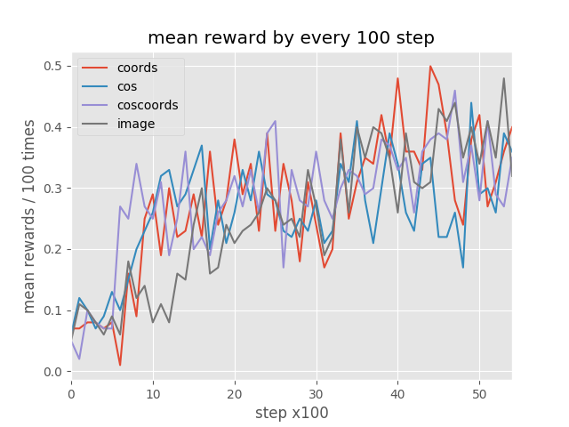

# Crane Challenge Round1 黒宮
## 発達心理学的なバックグラウンド
ピアジェの『発生的認識論』
https://docs.google.com/presentation/d/1gbud1U1vlG9NkaZqfUMHHUfbjR5iDoXvSDOued8R2Ds/edit?usp=sharing

物理法則の認識には因果関係の理解が重要(**具体的操作期**：9~10歳くらい)

しかし生後まもなくの赤ちゃんにも因果関係の理解力が備わっているという知見もある

### ex.モビール課題([Watanabe, 2009](http://www.sciencedirect.com/science/article/pii/S0163638308001112))

赤ちゃんの手の片方に糸でモビールを結びつけると、結んだ側の手がそうでない手に比べてよく動くようになる

(引用論文ではAL条件とLA条件の比較がメインですが)赤色のグラフを見ると、紐が結びついているときはBaselineよりもよく手を動かしていることが分かる。

つまり __赤ちゃんは自分が動くことによって環境が変化するとその行動が強化されるようになり__ こうした外界への働きかけを通じて因果関係の理解が促進されるのではないかということが言える

## 今回のコンセプト
上記のような知見に基づき、落とした時にもらえる報酬の代わりに自分が動いた時にサイコロも動くと報酬がもらえるようにした。
具体的には自分の動きのベクトルとサイコロの動きのベクトルのコサイン距離を報酬にし、自分の動きとサイコロの動きが同じであれば正の報酬（左図）、サイコロが動いていたとしても自分の動きとは無関係の場合は報酬０（右図）が与えられるようにした。

## 実行
`python train_[image].py`

## 学習結果

+ 「自発運動から随意運動へ」の解釈として、前半は触れたら報酬、後半は落としたら報酬という設定が学習が早く成績も良いモデルになった
+ 画像を入力としたものも座標を入力としたものに匹敵する成績をあげられた

## 反省点
+ サイコロが複数の時に対応できるか
+ サイコロと真反対に動くことがあるなど、失敗の仕方が人らしくない
